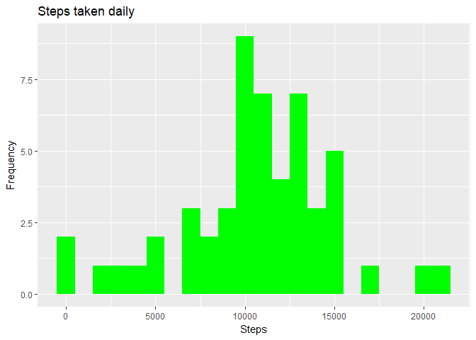
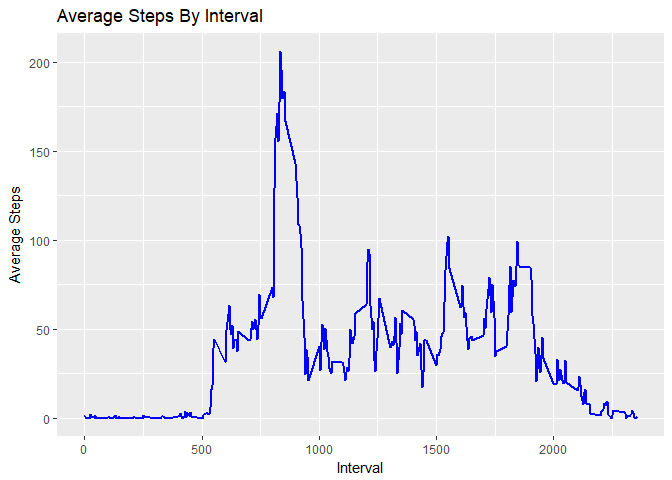
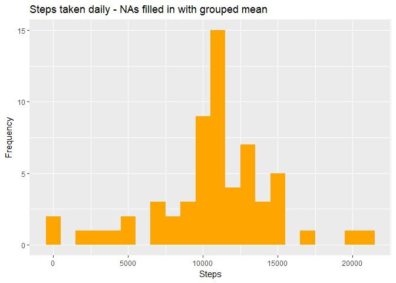
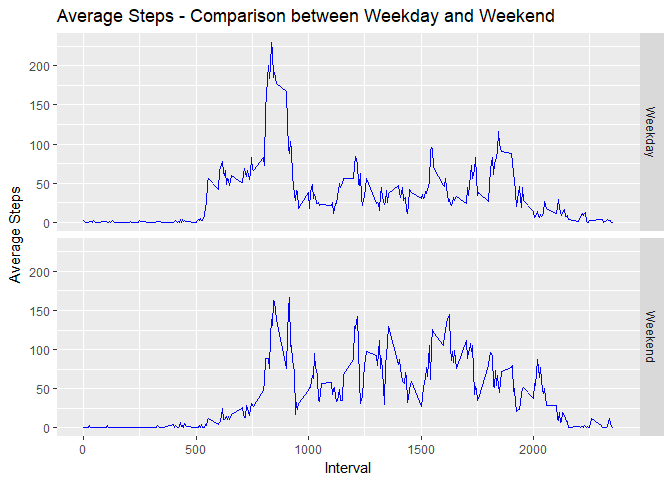

#                Reproducible Research - RMarkdown/Knitr Project

## Libraries needed

```r
library(dplyr)
```

```
## 
## Attaching package: 'dplyr'
```

```
## The following objects are masked from 'package:stats':
## 
##     filter, lag
```

```
## The following objects are masked from 'package:base':
## 
##     intersect, setdiff, setequal, union
```

```r
library(lubridate)
```

```
## 
## Attaching package: 'lubridate'
```

```
## The following object is masked from 'package:base':
## 
##     date
```

```r
library(ggplot2)
```

```
## Warning: package 'ggplot2' was built under R version 3.4.4
```
myActivityFn <- function() {

## 1. Read the data file

```r
activityData = read.csv("activity.csv", header=TRUE)
```

# --- Computation with original dataset ---

#### 2.a. Calculate the Mean, Total Steps for each day

```r
meanPerDay = activityData %>% na.omit() %>% group_by(ymd(date)) %>% summarize(meanSteps=mean(steps), totalSteps = sum(steps))
```

#### 2.b. Print the calculated data and plot the Total Steps per Day

```r
print(meanPerDay)
```

```
## # A tibble: 53 x 3
##    `ymd(date)` meanSteps totalSteps
##    <date>          <dbl>      <int>
##  1 2012-10-02      0.438        126
##  2 2012-10-03     39.4        11352
##  3 2012-10-04     42.1        12116
##  4 2012-10-05     46.2        13294
##  5 2012-10-06     53.5        15420
##  6 2012-10-07     38.2        11015
##  7 2012-10-09     44.5        12811
##  8 2012-10-10     34.4         9900
##  9 2012-10-11     35.8        10304
## 10 2012-10-12     60.4        17382
## # ... with 43 more rows
```

```r
g= ggplot(meanPerDay, aes(totalSteps)) + geom_histogram(fill="green", binwidth=1000) + xlab("Steps") + ylab("Frequency") + ggtitle("Steps taken daily")
print(g)
```

<!-- -->

```
## png 
##   2
```

```
## png 
##   4
```

```
## png 
##   2
```

#### 2.c. Calculate the Mean and Median of the Total steps taken

```r
meanAndMedian = meanPerDay %>% na.omit() %>% summarize(MeanofTotalSteps = mean(totalSteps), MedianofTotalSteps = median(totalSteps))
print(meanAndMedian)
```

```
## # A tibble: 1 x 2
##   MeanofTotalSteps MedianofTotalSteps
##              <dbl>              <int>
## 1           10766.              10765
```

#### 3.a. Calculate the AVergae Daily Activity (Steps)

```r
meanPerInterval = activityData %>% na.omit() %>% group_by(interval) %>% summarize(meanSteps=mean(steps), totalSteps=sum(steps))
print(meanPerInterval)
```

```
## # A tibble: 288 x 3
##    interval meanSteps totalSteps
##       <int>     <dbl>      <int>
##  1        0    1.72           91
##  2        5    0.340          18
##  3       10    0.132           7
##  4       15    0.151           8
##  5       20    0.0755          4
##  6       25    2.09          111
##  7       30    0.528          28
##  8       35    0.868          46
##  9       40    0.              0
## 10       45    1.47           78
## # ... with 278 more rows
```

#### 3.b. Plot the Average Daily Activity Pattern

```r
g = ggplot(meanPerInterval, aes(x=interval, y=meanSteps)) + geom_line(color="blue", size=1) + xlab("Interval") + ylab("Average Steps") + ggtitle("Average Steps By Interval")
print(g)
```

<!-- -->

```
## png 
##   2
```

```
## png 
##   5
```

```
## png 
##   2
```

#### 3.c. Which 5-minute interval contains the maximum steps across all days?

```r
index = which(meanPerInterval$totalSteps == max(meanPerInterval$totalSteps))
meanPerInterval$interval[index]
```

```
## [1] 835
```

# Dealing with missing values (NAs) - Computation with modified dataset
#### 4.a. Count the rows with mising values

```r
print(paste("Rows with missing values", sum(is.na(activityData))))
```

```
## [1] "Rows with missing values 2304"
```

#### 4.b. Create new dataset and substitue NAs with meaningful values like group mean

```r
newActivityData = activityData
newActivityData = newActivityData %>% group_by(interval) %>% mutate(steps= ifelse(is.na(steps), mean(steps, na.rm=TRUE), steps))
print(head(newActivityData))
```

```
## # A tibble: 6 x 3
## # Groups:   interval [6]
##    steps date       interval
##    <dbl> <fct>         <int>
## 1 1.72   2012-10-01        0
## 2 0.340  2012-10-01        5
## 3 0.132  2012-10-01       10
## 4 0.151  2012-10-01       15
## 5 0.0755 2012-10-01       20
## 6 2.09   2012-10-01       25
```

#### 4.c. Print the calculated data and plot the Total Steps per Day

```r
newMeanPerDay = newActivityData %>% group_by(ymd(date)) %>% summarize(newMeanSteps=mean(steps), newTotalSteps = sum(steps))
print(newMeanPerDay)
```

```
## # A tibble: 61 x 3
##    `ymd(date)` newMeanSteps newTotalSteps
##    <date>             <dbl>         <dbl>
##  1 2012-10-01        37.4          10766.
##  2 2012-10-02         0.438          126.
##  3 2012-10-03        39.4          11352.
##  4 2012-10-04        42.1          12116.
##  5 2012-10-05        46.2          13294.
##  6 2012-10-06        53.5          15420.
##  7 2012-10-07        38.2          11015.
##  8 2012-10-08        37.4          10766.
##  9 2012-10-09        44.5          12811.
## 10 2012-10-10        34.4           9900.
## # ... with 51 more rows
```

```r
g= ggplot(newMeanPerDay, aes(newTotalSteps)) + geom_histogram(fill="orange", binwidth=1000) + xlab("Steps") + ylab("Frequency") + ggtitle("Steps taken daily - NAs filled in with grouped mean")
print(g)
```

<!-- -->

```
## png 
##   2
```

```
## png 
##   6
```

```
## png 
##   2
```

#### 4.d. Calculate the Mean and Median of the Total steps taken

```r
newMeanAndMedian = newMeanPerDay %>% na.omit() %>% summarize(NewMeanofTotalSteps = mean(newTotalSteps), NewMedianofTotalSteps = median(newTotalSteps))
print(newMeanAndMedian)
```

```
## # A tibble: 1 x 2
##   NewMeanofTotalSteps NewMedianofTotalSteps
##                 <dbl>                 <dbl>
## 1              10766.                10766.
```

#### 4.e. Compare original dataset to the new dataset where the NAs are filled in with grouped median

```
## [1] "Original dataset"
```

```
## [1] "Mean:  10766.1886792453  Median:  10765"
```

```
## [1] "Modified dataset - NAs filled in with group Mean"
```

```
## [1] "Mean:  10766.1886792453  Median:  10766.1886792453"
```

```
## [1] "Take away with filling in NAs:"
```

```
## [1] "The replacement of NAs with group mean values did not cause any major variation"
```

#### 5.a. Create new variable with two levels- "Weekday" and "Weekend" to the modified dataset

```r
newActivityData$DayoftheWeek = ifelse(weekdays(as.Date(newActivityData$date)) %in% c("Monday","Tuesday","Wednesday", "Thursday", "Friday"), "Weekday", "Weekend")
print(head(newActivityData))
```

```
## # A tibble: 6 x 4
## # Groups:   interval [6]
##    steps date       interval DayoftheWeek
##    <dbl> <fct>         <int> <chr>       
## 1 1.72   2012-10-01        0 Weekday     
## 2 0.340  2012-10-01        5 Weekday     
## 3 0.132  2012-10-01       10 Weekday     
## 4 0.151  2012-10-01       15 Weekday     
## 5 0.0755 2012-10-01       20 Weekday     
## 6 2.09   2012-10-01       25 Weekday
```

#### 5.b. Plot a time series plot of interval against weekdays/weekends

```r
newMeanPerInterval = newActivityData %>% na.omit() %>% group_by(interval, DayoftheWeek) %>% summarize(newMeanSteps=mean(steps))
g = ggplot(newMeanPerInterval, aes(x=interval, y=newMeanSteps)) + geom_line(color="blue")+ facet_grid(DayoftheWeek~.) + xlab("Interval") + ylab("Average Steps") + ggtitle("Average Steps - Comparison between Weekday and Weekend")
print(g)
```

<!-- -->

```
## png 
##   2
```

```
## png 
##   7
```

```
## png 
##   2
```

      
}
